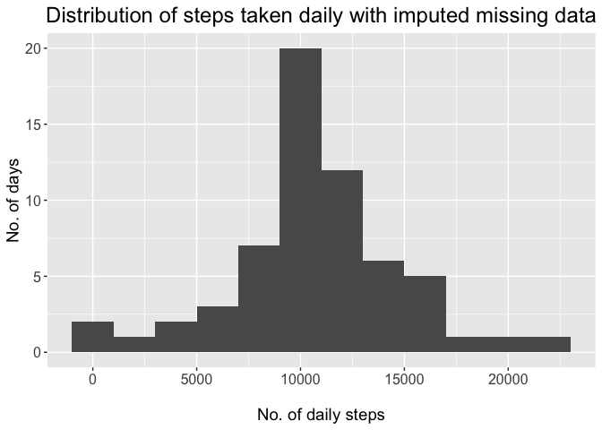

### Loading and preprocessing the data


```r
odata <- read_csv('data/activity.csv')
```

### Histogram of the total number of steps for each day


```r
daily <- odata %>%
    group_by(date) %>% 
    summarize(total = sum(steps))

# Plot:
daily %>%
  ggplot(aes(x = total)) +
  geom_histogram(binwidth = 2000) +
  labs(x = "\nNo. of daily steps",
       y = "No. of days",
       title = "Distribution of daily steps") + 
  my_theme()
```

<!-- -->

### Mean and median number of steps per day:


```r
# Mean/median values
day_mean <- mean(daily$total, na.rm = TRUE) %>% round()
day_median <- median(daily$total, na.rm = TRUE) %>% round()
```


Mean steps taken per day: **10766**

Median steps taken per day: **10765**


### What is the average daily activity pattern?


```r
interval_means <- odata %>%
  group_by(interval) %>%
  summarize(mean = mean(steps, na.rm = TRUE)) %>%
  ungroup() %>%
  na.omit()

# Take the row with highest mean (interval with highest mean steps)
interval_max <- interval_means %>%
  slice_max(mean, n=1) %>%
  # Round the values.
  round()

interval_means %>%
  ggplot(aes(x = interval, y = mean)) +
  geom_line() +
  labs(x = "\nTime interval",
       y = "Mean steps taken per 5-min interval\n",
       title = "Mean steps taken per time interval") + 
  my_theme()
```

<!-- -->

```r
# Convert interval code to time
interval_time <- id_to_time(interval_max$interval)
```

The above plot shows the number of steps taken, on average, during each 5-minute interval. During the study period, interval #835 was the one during which the most steps were taken--on average, 206. Interval #835 corresponds to 08:35:00.


### Imputing missing values

Missing data points: **2304**.

We will impute missing data with the mean value from the same intervals in remaining days. This is under the assumption that there are typical<- times of the day (e.g., 12 am through 6 am) where an individual is likely to be at rest. We use `data.table` which affords a good combination of execution speed and readability. Column `imputed` in the new dataframe (`impdata`) stores non-missing and imputed values.


```r
# Loading for fast operation when imputing
library(data.table)

# For readability, create a "lambda" function which will go into the
# data.table statement
impute.mean <- function(var) replace(var, is.na(var), mean(var, na.rm = TRUE))
# Create data.table
impdata <-setDT(odata)

impdata[,
        imputed := impute.mean(steps),
        by = interval,
        .SDcols = 'steps']

# On a copy of the data, group by day and sum daily steps
histdata <- impdata[,
                    .(total = sum(imputed)),
                    by = date]
# Plot histo
histdata %>%
  ggplot(aes(x = total)) +
  geom_histogram(binwidth = 2000) +
  labs(x = "\nNo. of daily steps",
       y = "No. of days",
       title = "Distribution of steps taken daily with imputed missing data"
       ) +
  my_theme()
```

<!-- -->


## Are there differences in activity patterns between weekdays and weekends?

To answer this question, we will use imputed data and convert the dates to a "day-of-the-week" integer (_i.e._, Monday = 1, Tuesday = 2, _etc…_). We'll then plot the mean steps taken per 5-minute interval during weekdays and weekends.


```r
# Get day-of-the-week and mark each row as "Weekdays" or "Weekends" (factor)
weekdata <- setDT(copy(impdata))
weekdata[, `:=`(day = as.integer(strftime(date, '%u')))]
weekdata[, `:=`(type = ifelse(day > 5, "Weekends", "Weekdays"))]
weekdata[, type := as.factor(type)]

# Compute mean values for each 5 min-interval
weekdata[, `:=`(mean_steps = mean(imputed, na.rm = TRUE),
                time = id_to_time(interval)),
     by = .(interval, type)]
# Select columns we're interested in
cols = c('date', 'interval', 'time', 'mean_steps', 'type')
# Aggregate for plotting
weekdata[, .SD[1L], by = .(interval, type), .SDcols = cols]
```

```
##      interval     type       date interval     time mean_steps     type
##   1:        0 Weekdays 2012-10-01        0 00:00:00       2.25 Weekdays
##   2:        5 Weekdays 2012-10-01        5 00:05:00       0.45 Weekdays
##   3:       10 Weekdays 2012-10-01       10 00:10:00       0.17 Weekdays
##   4:       15 Weekdays 2012-10-01       15 00:15:00       0.20 Weekdays
##   5:       20 Weekdays 2012-10-01       20 00:20:00       0.10 Weekdays
##  ---                                                                   
## 572:     2335 Weekends 2012-10-06     2335 23:35:00      11.59 Weekends
## 573:     2340 Weekends 2012-10-06     2340 23:40:00       6.29 Weekends
## 574:     2345 Weekends 2012-10-06     2345 23:45:00       1.71 Weekends
## 575:     2350 Weekends 2012-10-06     2350 23:50:00       0.03 Weekends
## 576:     2355 Weekends 2012-10-06     2355 23:55:00       0.13 Weekends
```

```r
# Plot by panel
weekdata %>% ggplot(aes(x = time, y = mean_steps)) +
  geom_line() + 
  facet_wrap(vars(type), labeller = label_value) + 
  labs(x = "Time of day (in 5-min increments)",
       y = "Steps taken",
       title = "Comparison of mean steps taken per interval, according to week day",
       subtitle = "Interval IDs converted to time") + 
  theme(
    strip.text = element_text(size = 12, hjust = 0.5, face = "bold"),
    plot.title = element_text(hjust = 0.5),
    plot.subtitle = element_text(hjust = 0.5, face = "italic")
  )
```

<!-- -->

