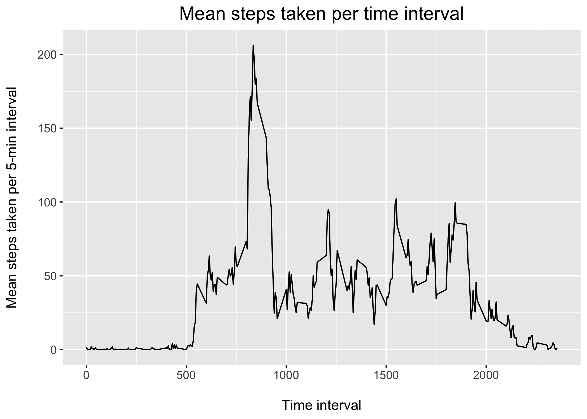

### Loading and preprocessing the data


```r
odata <- read_csv('data/activity.csv')
```

### Histogram of the total number of steps for each day


```r
daily <- odata %>%
    group_by(date) %>% 
    summarize(total = sum(steps))

# Plot:
daily %>%
  ggplot(aes(x = total)) +
  geom_histogram(binwidth = 2000) +
  labs(x = "No. of daily steps", y = "No. of days")
```

<!-- -->

### Mean and median number of steps per day:


```r
# Mean/median values
day_mean <- mean(daily$total, na.rm = TRUE) %>% round()
day_median <- median(daily$total, na.rm = TRUE) %>% round()
```


Mean steps taken per day: **10766**

Median steps taken per day: **10765**


### What is the average daily activity pattern?


```r
interval_means <- odata %>%
  group_by(interval) %>%
  summarize(mean = mean(steps, na.rm = TRUE)) %>%
  ungroup() %>%
  na.omit()

# Take the row with highest mean (interval with highest mean steps)
interval_max <- interval_means %>%
  slice_max(mean, n=1) %>%
  # Round the values.
  round()

interval_means %>%
  ggplot(aes(x = interval, y = mean)) +
  geom_line() +
  labs(x = "\nTime interval number", y = "Mean steps taken per 5-min interval\n")
```

<!-- -->

```r
# 5-min interval with highest mean steps taken, converted to time of day
# interval_time <- interval_max$interval * 60 %>%
#   seconds_to_period()
```

The above plot shows the number of steps taken, on average, during each 5-minute interval. During the study period, interval #835 was the one during which the most steps were taken--on average, 206. Interval #835 roughly corresponds to 13:55:00


## Imputing missing values

## Are there differences in activity patterns between weekdays and weekends?
